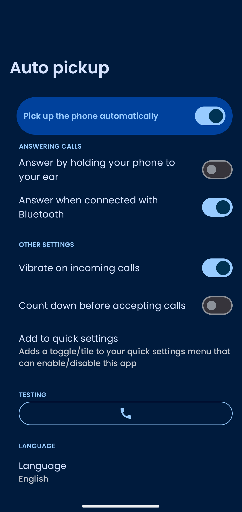

    
    <h1>Auto Pickup</h1>
    
A helpful accessibility tool for automatically picking up your phone.

---

_UI inspired by https://github.com/TheLastProject/RaiseToAnswer_

## Features

- Lift to answer
- Answer when connectivity Bluetooth device is connected
- Vibrate/beep on answer
- Quick settings toggle
- Multi-language support
- Material 3 & Material You

  

## Installation

## License

The source code of this project is licenced under the GNU GPLv3 licence, a copy is available in
LICENSE.
